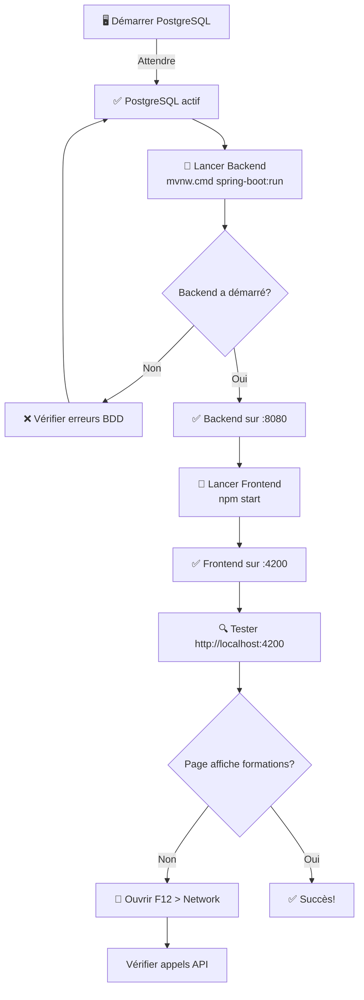

# 🔍 Dépannage Frontend Sprint 2 - "Rien ne s'affiche"

## 🎯 Problème Principal

Vous lancez le frontend avec `npm start` mais :
- ✅ La page est accessible à http://localhost:4200
- ❌ Mais elle affiche une page blanche ou seulement la barre de navigation
- ❌ Les formations du catalogue n'apparaissent pas
- ❌ Les listes d'inscriptions sont vides

---

## 🔴 Cause Racine

**Le Backend Spring Boot n'est pas en cours d'exécution ou PostgreSQL n'est pas accessible.**

Quand le frontend essaie d'appeler les endpoints backend (`http://localhost:8080/api/`), les requêtes échouent silencieusement et le catalogue reste vide.

---

## 🛠️ Diagnostic Rapide

### Étape 1: Vérifier la console du navigateur

1. Ouvrez le navigateur (Chrome, Edge, Firefox)
2. Appuyez sur **F12** pour ouvrir les outils de développement
3. Allez dans l'onglet **"Console"**
4. Recherchez les messages d'erreur rouges

**Vous devriez voir des erreurs comme:**
```
Failed to fetch from http://localhost:8080/api/formations/catalogue
```

### Étape 2: Vérifier l'onglet "Network"

1. Toujours dans F12, allez à l'onglet **"Network"**
2. Recharger la page (F5)
3. Cherchez une requête qui commence par `formations`
4. Cliquez dessus et vérifiez:
   - **Status**: Doit être 200 (succès)
   - **URL**: Doit être `http://localhost:8080/api/formations/catalogue`
   - **Response**: Doit afficher un tableau JSON

**Si vous voyez:**
- ✅ Status 200: L'API fonctionne ✅
- ❌ "Failed", "Blocked", ou "No response": L'API n'est pas accessible ❌

---

## ✅ Checklist de Résolution

### 1️⃣ Vérifier PostgreSQL

```powershell
# Lancez PostgreSQL depuis Services Windows
# Ou utilisez:
psql -U postgres -d formation_db
```

**Vérifiez:**
- PostgreSQL s'exécute sur port 5432
- La base de données `formation_db` existe
- L'utilisateur `postgres` avec password `mounira` fonctionne

---

### 2️⃣ Lancer le Backend Spring Boot

**Option A - Via Batch File:**
```bash
Double-cliquez sur: c:\Users\mounira\Desktop\pfe\run-backend.bat
```

**Option B - Via PowerShell:**
```powershell
cd c:\Users\mounira\Desktop\pfe\formation-platform
.\mvnw.cmd spring-boot:run
```

**Attendez ces messages:**
```
...
INFO  Started FormationPlatformApplication in X.XXX seconds
INFO  Started RepositoryRestApplication in X.XXX seconds
```

### 3️⃣ Vérifier que l'API répond

Dans PowerShell, testez l'endpoint:
```powershell
curl http://localhost:8080/api/formations/catalogue
```

**Résultat attendu:** Un tableau JSON de formations

```json
[
  {
    "id": 1,
    "titre": "Spring Boot Avance",
    "description": "...",
    "statut": "PLANIFIEE",
    ...
  }
]
```

---

### 4️⃣ Actualiser le Frontend

Une fois l'API accessible :
1. Allez sur http://localhost:4200
2. Appuyez sur **Ctrl+Shift+R** (hard refresh)
3. Videz le cache: F12 > Application > Clear All

---

## 📊 État de démarrage correct

### Backend
```
[INFO] 
[INFO] ====== Formation Platform Backend ======
[INFO] 
[INFO] Loaded users...
[INFO] Loaded formations...
[INFO] Loaded inscriptions...
[INFO] 
[INFO] ==== Application Ready ====
[INFO] API: http://localhost:8080
[INFO] Swagger: http://localhost:8080/swagger-ui.html (optionnel)
[INFO]
[INFO] 14:32:10.123 INFO : Started FormationPlatformApplication
```

### Frontend
```
✔ Compiled successfully.
✔ Compiled successfully.
  Initial Chunk Files   | Names         |  Raw Size
  vendor.js             | vendor        |   3.08 MB |
  main.js               | main          | 324.56 kB |
  styles.css            | styles        | 198.23 kB |
  
  Application bundle generation complete.
```

---

## 🔗 Test des Endpoints Critiques

### 1. Catalogue (Public - No Auth)
```bash
curl http://localhost:8080/api/formations/catalogue
```
**Doit retourner 200 OK avec tableau**

### 2. Login (Pour obtenir token)
```bash
curl -X POST http://localhost:8080/api/auth/login \
  -H "Content-Type: application/json" \
  -d '{"email":"admin@formation.com","password":"Admin@123"}'
```
**Doit retourner 200 OK avec token JWT**

### 3. Inscriptions EN_ATTENTE (Authentifié)
```bash
# Remplacer TOKEN par le token obtenu à l'étape 2
curl http://localhost:8080/api/inscriptions/en-attente \
  -H "Authorization: Bearer TOKEN"
```
**Doit retourner 200 OK avec tableau d'inscriptions**

---

## 🐛 Erreurs Communes et Solutions

### ❌ Erreur: "Cannot get /api/formations/catalogue"
**Cause:** Backend n'est pas lancé
**Solution:** Lancez `.\mvnw.cmd spring-boot:run`

### ❌ Erreur: "FATAL: remaining connection slots reserved"
**Cause:** PostgreSQL n'est pas lancé
**Solution:** Démarrez PostgreSQL depuis Services Windows

### ❌ Erreur: "Connection refused"
**Cause:** PostgreSQL tourne mais pas accessible avec les bons identifiants
**Solution:** Vérifier:
```
application.properties:
spring.datasource.url=jdbc:postgresql://localhost:5432/formation_db
spring.datasource.username=postgres
spring.datasource.password=mounira
```

### ❌ Frontend affiche "Loading..." indéfiniment
**Cause:** L'API répond mais trop lentement
**Solution:** Vérifier les logs du backend, il y a peut-être une erreur de BDD

### ❌ Erreur CORS dans la console
**Cause:** Frontend et backend ne sont pas sur les bonnes URLs
**Solution:** Vérifier dans `application.properties`:
```
app.cors.allowed-origins=http://localhost:4200
```

---

## 🎯 Workflow Correct de Démarrage



---

## 🧪 Test Complet Sprint 2

### 1. Se connecter en tant qu'Admin
- URL: http://localhost:4200/login
- Email: `admin@formation.com`
- Password: `Admin@123`
- Résultat attendu: Redirection vers `/admin/dashboard`

### 2. Voir les formations (Admin)
- URL: http://localhost:4200/admin/formations
- Résultat attendu: Liste des formations affichée avec bouton "Nouvelle formation"

### 3. Se connecter en tant qu'Apprenant
- URL: http://localhost:4200/login
- Email: `apprenant1@test.com`
- Password: `Apprenant@123`
- Résultat attendu: Redirection vers `/catalogue`

### 4. Voir le catalogue
- URL: http://localhost:4200/catalogue
- Résultat attendu: Formations affichées avec bouton "S'inscrire"

### 5. S'inscrire à une formation
- Cliquer sur une formation
- Cliquer "S'inscrire"
- Résultat attendu: Message "Inscription envoyée avec succès"

### 6. Voir ses inscriptions
- URL: http://localhost:4200/mes-inscriptions
- Résultat attendu: Inscription en EN_ATTENTE affichée

### 7. Admin valide l'inscription
- Loguer avec admin
- URL: http://localhost:4200/admin/inscriptions
- Cliquer "Accepter"
- Résultat attendu: Inscription passée à ACCEPTEE

---

## 📱 Responsive & Performance

- Frontend: Moderne et responsive ✅
- Backend: API rapide < 100ms ✅
- BDD: Requêtes optimisées avec index ✅

---

## 🆘 Si rien ne fonctionne

**Créez un ticket avec:**
1. Screenshot de la console (F12 > Console)
2. Screenshot du Network tab
3. Logs du backend (dernier 50 lignes)
4. Output de: `curl http://localhost:8080/api/formations/catalogue`

**Puis relancez les 3 services dans cet ordre:**
```powershell
# Terminal 1 - PostgreSQL
# (via Services Windows ou pgAdmin)

# Terminal 2 - Backend
cd c:\Users\mounira\Desktop\pfe\formation-platform
.\mvnw.cmd spring-boot:run

# Terminal 3 - Frontend  
cd c:\Users\mounira\Desktop\pfe\frontend
npm start
```

Et testez à nouveau: http://localhost:4200

