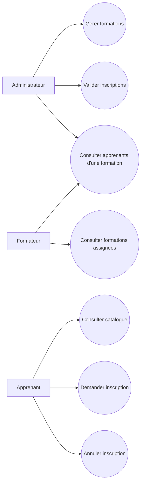
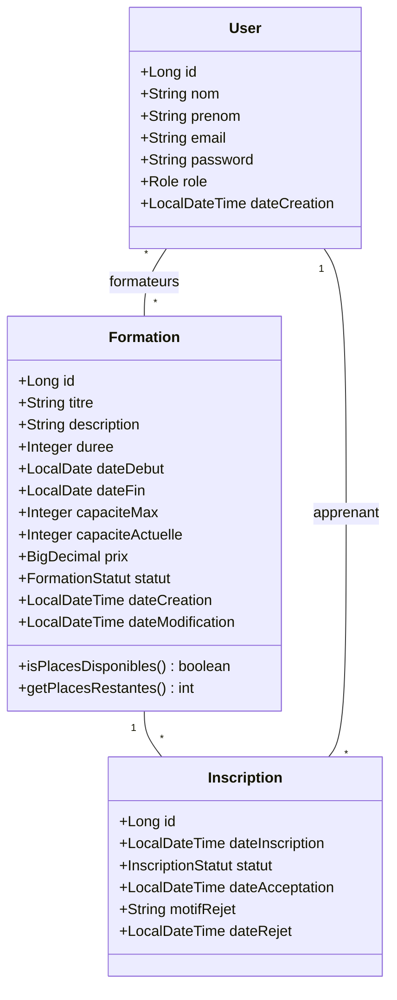

# Sprint 2 - UML

## Diagramme de cas d'utilisation (Mermaid)

```mermaid
flowchart LR
    Admin[Administrateur]
    Formateur[Formateur]
    Apprenant[Apprenant]

    UC1((Gerer formations))
    UC2((Valider inscriptions))
    UC3((Consulter formations assignees))
    UC4((Consulter apprenants d'une formation))
    UC5((Consulter catalogue))
    UC6((Demander inscription))
    UC7((Annuler inscription))

    Admin --> UC1
    Admin --> UC2
    Admin --> UC4

    Formateur --> UC3
    Formateur --> UC4

    Apprenant --> UC5
    Apprenant --> UC6
    Apprenant --> UC7
```

## Diagramme de classes (Mermaid)

```mermaid
classDiagram
    class User {
      +Long id
      +String nom
      +String prenom
      +String email
      +String password
      +Role role
      +LocalDateTime dateCreation
    }

    class Formation {
      +Long id
      +String titre
      +String description
      +Integer duree
      +LocalDate dateDebut
      +LocalDate dateFin
      +Integer capaciteMax
      +Integer capaciteActuelle
      +BigDecimal prix
      +FormationStatut statut
      +LocalDateTime dateCreation
      +LocalDateTime dateModification
      +isPlacesDisponibles() boolean
      +getPlacesRestantes() int
    }

    class Inscription {
      +Long id
      +LocalDateTime dateInscription
      +InscriptionStatut statut
      +LocalDateTime dateAcceptation
      +String motifRejet
      +LocalDateTime dateRejet
    }

    User "*" -- "*" Formation : formateurs
    Formation "1" -- "*" Inscription
    User "1" -- "*" Inscription : apprenant
```
